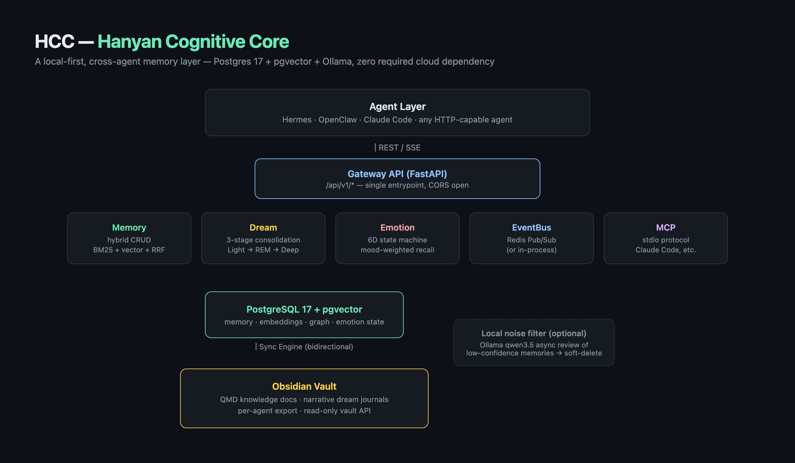

# HCC — Hanyan Cognitive Core

[English](README.en.md) | [中文](README.md)

[](LICENSE)


-blueviolet)

**A unified memory layer for any agent**: an independently-deployed REST service that consolidates memory storage, hybrid retrieval, a knowledge graph, emotional state, dream-style memory consolidation, and bidirectional Obsidian sync behind one database and one API — reachable from Hermes, OpenClaw, Claude Code, or literally any agent that can make an HTTP request.

HCC is not a memory plugin baked into one agent framework — it's a cognitive operating system that lives **outside any specific agent runtime**. If your agent can speak HTTP, it gets persistent memory, semantic retrieval, emotional continuity, and nightly memory consolidation for free. **Works with OpenClaw / Hermes / Claude Code** out of the box — an official OpenClaw plugin (`hcc-memory`) and a Claude Code MCP server are already included; any other agent runtime just needs to send HTTP requests.

## About this project

The HCC core is **fully MIT-licensed**: the memory layer, hybrid retrieval, knowledge graph, dream consolidation, emotion engine, and bidirectional Obsidian sync are all open source, ready to fork, self-host, and extend. There is no closed-source core.

`hcc-openclaw-plugin/` (`hcc-memory`) is how this memory layer lands in the OpenClaw ecosystem: a standalone plugin package with a proper `openclaw.plugin.json` manifest and declarative `configSchema`, built to be installable straight from an OpenClaw plugin marketplace/community list — no changes to OpenClaw core required. The same "REST gateway + thin client" pattern can give Hermes, Claude Code (via MCP), or any HTTP-capable agent the same memory superpowers. **Open-source core + multi-runtime plugin distribution** is the long-term shape of this project.

---

## ✨ Dream system — your agent dreams

Most memory systems just dump conversations into a database and fish results back out on retrieval. HCC does something different: every day, it takes everything it learned while "awake" and **dreams about it**, the way people consolidate memory during sleep:

- 🌙 **Light** — short-cycle aggregation of the day's scattered memories, a first lightweight pass of summarization
- 🌀 **REM** — cross-day clustering that finds themes, stringing together related memories scattered across many days
- 🌊 **Deep** — dedup and distillation into real, durable knowledge, written back into Memory

All three stages are **idempotent** (each stage runs at most once per day), so the agent wakes up with a knowledge base that's clearer and more refined than when it went to sleep — this is real memory consolidation, not log rotation. Better still, every dream produces a **narrative dream journal** entry written into the Obsidian vault: not a dry processing log, but first-person prose about "what I dreamed about today, what I remembered," paired with a structured audit report so you can trace any piece of knowledge back to its source. Your agent doesn't just remember things — it digests and grows, quietly, at night, while no one's watching.

## ✨ Emotion system — memory needs a mood

HCC ships a built-in **6-dimensional emotion engine**: happiness / curiosity / fatigue / worry / closeness / focus, continuously evolving with every conversation, every memory, every dream — not a hardcoded persona switch, but genuine continuous state that drifts with interaction history. Multiple dimensions combine into **named composite emotional states** (e.g. "elated," "low"), so the agent's emotional expression has a name, is recognizable, and is traceable — not just a row of cold numbers.

Emotion isn't decoration: retrieval results are weighted for consistency with the current mood, and the Dream Deep stage can feed back and adjust the emotional baseline — memory shapes mood, and mood shapes what the agent recalls and how it thinks. Emotional state is written back at `session_end` and warm-started at `session_start`, staying continuous across sessions so your agent doesn't "wake up amnesiac" every time a conversation opens. The dedicated `/emotion/display` endpoint exists specifically for physical **USB mini-displays** — put your agent's current mood right there on the desk, visible at a glance. This isn't feature-stuffing — it's making "companionship" something you can actually point to.

---

## Architecture



```
                         ┌─────────────────────────────┐
                         │          Agent layer          │
                         │  Hermes / OpenClaw / Claude    │
                         │  Code / any HTTP-capable agent │
                         └───────────────┬───────────────┘
                                         │ REST / SSE
                         ┌───────────────▼───────────────┐
                         │      Gateway API (FastAPI)     │
                         │  /api/v1/* — single entrypoint │
                         └───┬─────┬─────┬─────┬─────┬────┘
                             │     │     │     │     │
              ┌──────────────┘     │     │     │     └──────────────┐
              ▼                    ▼     ▼     ▼                    ▼
        ┌───────────┐   ┌──────────┐ ┌──────┐ ┌────────────┐ ┌───────────┐
        │  Memory   │   │  Dream   │ │Emotion│ │  EventBus  │ │    MCP    │
        │hybrid CRUD │   │3-stage   │ │6D FSM │ │Redis Pub/Sub│ │  stdio    │
        └─────┬─────┘   └────┬─────┘ └──┬───┘ └──────┬─────┘ └───────────┘
              │              │          │            │
              └──────┬───────┴──────────┴────────────┘
                     ▼
         ┌───────────────────────┐        ┌─────────────────────┐
         │   PostgreSQL 17        │        │  Local noise filter  │
         │   + pgvector           │◄───────┤ Ollama qwen3.5 async │
         └───────────┬───────────┘        └─────────────────────┘
                     │
                     ▼ Sync Engine (bidirectional)
         ┌───────────────────────┐
         │  Obsidian Vault         │
         │  QMD knowledge docs /    │
         │  dream journals / vault  │
         │  API / per-agent export  │
         └───────────────────────┘
```

- **Gateway API**: single FastAPI entrypoint, every module exposed under `/api/v1/*`, CORS open
- **Memory**: memory CRUD + three retrieval modes (keyword / vector / hybrid BM25+vector+RRF)
- **Dream**: nightly three-stage memory consolidation (Light aggregation → REM clustering → Deep dedup/distill), with Obsidian dream journals
- **Emotion**: 6-dimensional emotion engine (happiness/curiosity/fatigue/worry/closeness/focus) + named state machine, evolving with conversations/memories/dream events
- **EventBus**: Redis Pub/Sub (optional; degrades to an in-process broadcaster when unset), drives emotion linkage, noise-filter review, SSE push
- **Sync**: bidirectional PostgreSQL ↔ Markdown sync engine, scheduled + event-triggered
- **Obsidian**: QMD knowledge doc generation, per-agent memory export, read-only vault browsing API, dream journal writes
- **Local noise filter**: asynchronously subscribes to memory-write events, uses a local Ollama model to re-review low-confidence memories (tool results / plugin writes), soft-deletes noise without blocking the write path
- **MCP**: stdio protocol server exposing core memory tools to MCP-capable clients (Claude Code, etc.)

---

## Features

- **Hybrid retrieval**: BM25 (PostgreSQL full-text + jieba Chinese tokenization) + pgvector vector search, fused with RRF (Reciprocal Rank Fusion), optional Qwen3 cross-encoder reranking (`HCC_RERANK_ENABLED`)
- **Local-model noise filtering**: low-confidence memories (tool call results, third-party plugin writes) get an async second look from Ollama `qwen3.5:4b`; noise is soft-deleted (`status=discarded`), never blocks writes, never hard-deletes
- **Three-stage dreaming**: Light (short-cycle aggregation) → REM (cross-day tag clustering to find themes) → Deep (dedup, distill into knowledge, write back to Memory + dream journal), all idempotent (once per stage per day, `force` to override)
- **6-dimensional emotion state machine**: happiness / curiosity / fatigue / worry / closeness / focus as continuous dimensions + named composite states (e.g. "elated"/"low"); retrieval results weighted for mood consistency; Dream Deep stage can feed back into the emotional baseline
- **Bidirectional Obsidian export**: auto-generated knowledge docs (QMD), human-readable per-agent memory export, dream journals (narrative + audit report, two files), automatic orphan-doc archiving
- **Read-only vault API**: `/vault/list` / `/vault/read`, strictly confined to `HCC_VAULT_ROOT` (rejects `..`, rejects symlink escapes, rejects absolute paths)
- **SSE cross-client awareness**: `/events/stream` pushes memory-change events (store/update/delete) to sidecar listeners, keeping multiple clients in sync
- **Redis EventBus**: optional; gracefully degrades to an in-process event bus when unconfigured — zero coupling between modules

---

## Performance and cost

Real 30-day production usage data from the author's own agent (DeepSeek API billing — not a marketing benchmark):

| Metric | Value |
|:-----|:-----|
| 30-day total cost | ¥285.67 (~US$40) |
| Daily average | ~¥9.5 (~US$1.3) |
| **Prompt cache hit rate** | **98%** (6313.6M tokens hit / 126.8M missed) |
| Output tokens | 13.6M |
| Cost breakdown | flash ¥277.43 (97%) + pro ¥8.24 (3%) |

**Why it's this cheap:**

- **The 98% cache hit rate is structural, not lucky** — HCC assembles memory-retrieval results and system context into a stable, reusable structure, so repeated context hits the cache price instead of being re-billed at full rate every turn
- **Local embeddings, zero API cost** — vectorization defaults to local Ollama (`qwen3-embedding:0.6b`, 1024-dim, stronger Chinese semantics than `nomic-embed-text`); hybrid/semantic search never incurs an embedding API bill
- **No OCR, no forced cloud dependency** — PDF/document indexing runs through local `pdf-inspector`, noise filtering runs through a local Ollama model reviewing low-confidence memories; unless you deliberately wire in a cloud LLM API, the entire memory pipeline can run fully offline and generate zero bill
- **BM25 + vector hybrid retrieval** (RRF fusion, optional Qwen3 cross-encoder rerank) — most recall doesn't need to trigger expensive semantic reranking, further cutting per-call cost

> Data from [icemaple77](https://github.com/icemaple77)'s own production agent billing snapshot (2026-08). Your actual cost will vary with the model, call volume, and context structure you use — for reference only.

---

## Quick start

### Requirements

- Python 3.11+
- PostgreSQL 17 + the [pgvector](https://github.com/pgvector/pgvector) extension
- Redis (optional; the event bus degrades to in-process broadcasting without it)
- Ollama (optional; needed for local noise filtering / local embeddings — not required to run at all, `HCC_EMBEDDING_PROVIDER=hash` gives you a zero-dependency hash embedding)

### Install

**Option 1: one-line install script (recommended)**

```bash
git clone https://github.com/icemaple77/hanyan-cognitive-core.git
cd hanyan-cognitive-core
./install.sh
```

`install.sh` detects/installs Python 3.11+, PostgreSQL 17 + pgvector (uses `docker compose` to spin up a pgvector container if Docker is available, falls back to a native Homebrew/apt install otherwise), optional Redis/Ollama, creates a venv, installs dependencies, generates `.env`, and creates tables — idempotent, safe to re-run. Flags: `--full` (adds rerank + PDF extras), `--skip-db` / `--skip-redis` / `--skip-ollama`; run `./install.sh --help` for the full list.

**Option 2: manual install**

```bash
git clone https://github.com/icemaple77/hanyan-cognitive-core.git
cd hanyan-cognitive-core

# with uv (recommended, repo ships a uv.lock)
uv sync

# or with pip
python3 -m venv .venv && source .venv/bin/activate
pip install -e ".[dev]"
```

### Configure

```bash
cp .env.example .env
# at minimum, point HCC_DATABASE_URL at a reachable PostgreSQL instance
```

Key environment variables (full list in `.env.example`, with per-item docs in `gateway/core/config.py` / `core/config.py`):

| Variable | Description |
|:-----|:-----|
| `HCC_DATABASE_URL` | PostgreSQL connection string (required) |
| `HCC_QMD_DIR` | Output directory for Obsidian knowledge docs |
| `HCC_REDIS_ENABLED` | Redis EventBus toggle, default `false` (in-process broadcasting) |
| `HCC_NOISE_FILTER_ENABLED` | Local noise-filter toggle, default `true` (needs local Ollama) |
| `HCC_RERANK_ENABLED` | Cross-encoder rerank toggle for hybrid search, default `false` |
| `HCC_VAULT_ROOT` | Obsidian vault root, used by the `/vault/*` API and dream journals |

### Start the database (Docker, optional)

```bash
docker compose up -d db redis   # dependencies only — doesn't run HCC itself in a container
```

You can also point `.env` at PostgreSQL/Redis you already have running locally — Docker isn't required for local development.

### Start HCC

```bash
uv run uvicorn gateway.main:app --reload --host 0.0.0.0 --port 8000
# or via Makefile
make dev
```

First boot auto-creates tables (SQLAlchemy metadata `create_all`) and starts 3 dream background loops plus a sync loop (controlled by `HCC_DREAM_AUTO_ENABLED` / `HCC_SYNC_AUTO_ENABLED`).

### Health check

```bash
curl http://localhost:8000/api/v1/health
# → {"status":"ok","version":"0.1.0","service":"hanyan-cognitive-core"}
```

### Containerized deployment (optional)

The repo ships a `Dockerfile` + `docker-compose.yml` (four services: api + mcp + db + redis), suited for deploying to a persistent server:

```bash
docker compose up -d
```

---

## API endpoints

All endpoints share the `/api/v1` prefix. Full interactive OpenAPI docs at `http://localhost:8000/docs` once running.

### Memory

```
POST /memory/store          — store a memory
POST /memory/search         — keyword search (ILIKE, supports user_id/agent_id/shared filters)
POST /memory/update         — update
POST /memory/delete         — delete
POST /memory/touch          — hit reinforcement (access_count+1, last_access=now)
GET  /memory/recent         — recent memories
POST /memory/semantic-search — pure vector semantic search
POST /memory/hybrid-search   — BM25 + vector hybrid, RRF fusion (recommended entrypoint)
```

Example:

```bash
curl -X POST http://localhost:8000/api/v1/memory/hybrid-search \
  -H "Content-Type: application/json" \
  -d '{"query":"what broke in last deploy","limit":10,"user_id":"me","agent_id":"main"}'
```

### Document (standalone knowledge base search, separate from the Memory table)

```
POST /document/search
POST /document/hybrid-search
GET  /document/recent
```

### Context (single-call auto-orchestration)

```
POST /context   — auto-orchestrates Memory + Knowledge + Emotion, one call returns assembled context
```

### Graph

```
POST /graph/entity              — add an entity
POST /graph/relation            — add a relation
POST /graph/query               — query the graph
GET  /graph/entity/{entity_id}  — entity detail
```

### Emotion

```
GET  /emotion/state       — current emotion (full dimensions, for agent-internal use)
GET  /emotion/display     — current emotion (display mode, for mini-screens/UI)
POST /emotion/update      — trigger an emotion update from text
GET  /emotion/history     — recent trigger log
GET  /emotion/snapshots   — daily cold snapshots (generated in Deep stage, for mood-trend review)
```

### Dream (three-stage consolidation)

```
POST /dream/light     — trigger the Light stage (idempotent: once per memory per day)
POST /dream/rem       — trigger the REM stage (idempotent: once per day)
POST /dream/deep      — trigger the Deep stage, writes to Memory + journal (idempotent: once per day)
GET  /dream/status    — last-run time per stage + current threshold config
```

### Vault (read-only Obsidian browsing)

```
GET /vault/list?path=   — list a directory (defaults to vault root)
GET /vault/read?path=   — read a file (path escapes are always rejected)
```

### Sync / Export

```
POST /sync/qmd            — manually trigger a PostgreSQL → Markdown sync
GET  /sync/status         — sync status
POST /export/agents       — regenerate per-agent_id human-readable export
```

### Events (SSE)

```
GET /events/stream   — subscribe to the memory-change event stream (store/update/delete)
```

### Cognitive subsystems

```
POST /orchestrator/evaluate   — decide whether a piece of content is worth storing
GET  /forget/scan             — forgetting scan (read-only, no writes)
POST /forget/apply            — apply forgetting (archive, never a hard delete)
GET  /personality/summary     — personality profile
POST /personality/process     — process text, update personality profile
POST /subconscious/retrieve   — three-tier retrieval (conscious/preconscious/subconscious)
GET  /router/summary          — model routing config
POST /router/profile          — switch hardware profile
POST /optimizer/scan          — scan for absorbable files
POST /optimizer/run           — run full workspace optimization
POST /optimizer/bootstrap     — generate bootstrap files
POST /indexer/scan            — scan workspace knowledge files
POST /indexer/run             — index workspace knowledge
POST /dream/consolidate       — legacy one-shot memory consolidation (backward-compat; use the three-stage endpoints above for new code)
```

### MCP tools (stdio protocol, `mcp/server.py`)

```
store_memory / search_memories / recall / semantic_search /
hybrid_search / get_recent_memories / delete_memory / evaluate
```

In any MCP-capable client (e.g. Claude Code), configure `mcp/server.py` as a stdio server and you're set.

---

## OpenClaw integration

`hcc-openclaw-plugin/` is a standalone OpenClaw plugin (`hcc-memory`) that calls HCC's REST API over HTTP — it doesn't need to be co-located with HCC, and is built as an independent distribution unit that can go straight into an OpenClaw plugin marketplace/community list. See [`hcc-openclaw-plugin/README.md`](hcc-openclaw-plugin/README.md) for details; highlights:

- **Tools**: `memory_search` (via `/memory/hybrid-search`, BM25+vector+RRF fusion), `memory_get` (by id or content match)
- **`session_start` auto-recall + emotion warm-start**: at the start of a new session, automatically pulls relevant history (top-N by importance) and current emotional state from HCC, injecting them into system context in one shot on the next `before_prompt_build` — the agent doesn't need to wait for the user to ask what happened last time
- **`session_end` emotion write-back**: feeds a summary of the session into `/emotion/update` at session end, so emotional state evolves continuously across sessions and the next `session_start` reads the latest mood
- **Other hooks**: `before_compaction` (pre-compaction snapshot), `tool_result_persist` (low-weight storage of tool results, paired with HCC-side async noise-filter review)
- **Config**: plugin `configSchema` fields `baseUrl` / `userId` / `agentId`, or the equivalent `HCC_BASE_URL` / `HCC_USER_ID` / `HCC_AGENT_ID` env vars; see the plugin README for `session_start`/emotion-related toggles

---

## FAQ / deployment notes

- **No Docker needed for local dev**: any reachable PostgreSQL instance (with the pgvector extension) works — just point `HCC_DATABASE_URL` at it and run `uvicorn` directly. Redis and Ollama are both optional; the corresponding features degrade gracefully or turn off when unconfigured.
- **Zero-dependency embedding path**: `HCC_EMBEDDING_PROVIDER=hash` swaps in a deterministic hash instead of a real vector model — useful for getting the pipeline running before wiring in a real embedding backend (`ollama` or `sentence-transformers`).
- **Reranking is an optional bonus, not a requirement**: with `HCC_RERANK_ENABLED=false` (default), hybrid search is still full BM25+vector+RRF fusion — it just skips the second-pass cross-encoder rerank.
- **Tables auto-create**: first `uvicorn` boot runs SQLAlchemy `create_all` automatically, so you don't need to run migrations to start developing (production deployments should wire up Alembic, which is already listed as a dependency).
- **Containerized deployment**: `docker-compose.yml` provides an api + mcp + db + redis four-service stack for persistent servers; `Dockerfile` packages only gateway/core/scanner/mcp, no dev dependencies.

---

## License

[MIT](LICENSE)
