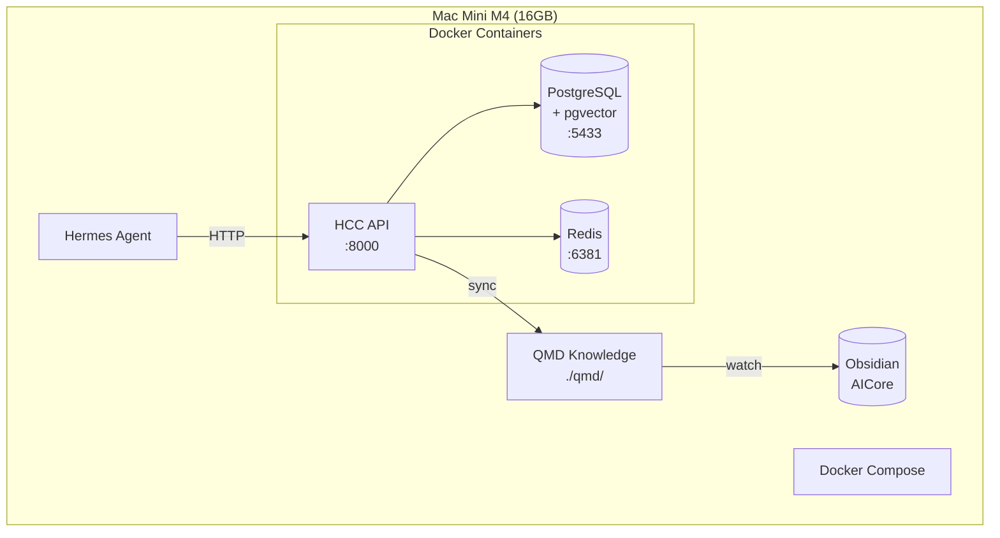
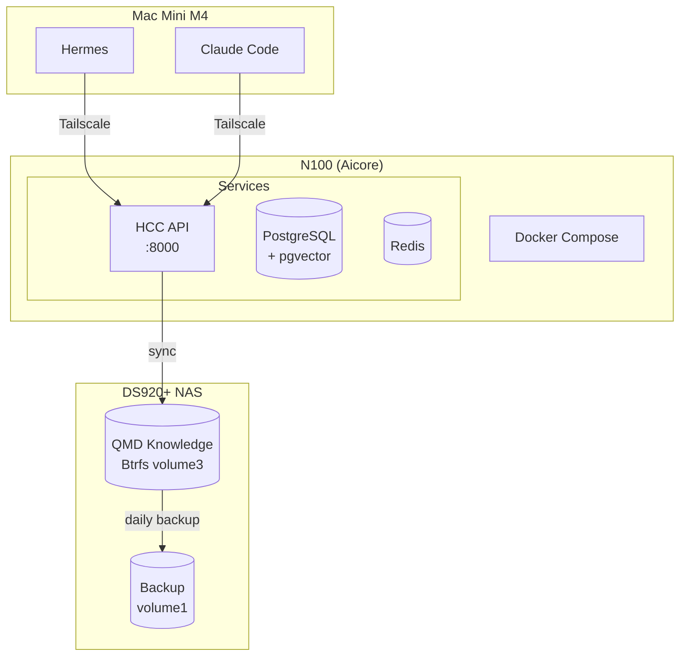
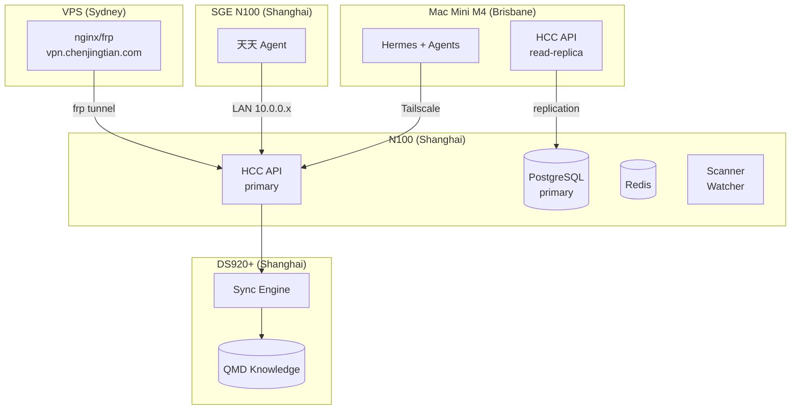

# HCC 部署图

## 单机版（Mac Mini M4）

**适用场景：** 个人开发、测试、低负载使用
**模型：** ollama 本地模型（qwen3:8b / qwen3:14b）

## NAS 版（DS920+）

**适用场景：** 持续运行、数据持久化、知识管理
**模型：** N100 本地 ollama + Mac Mini M4 辅助计算

## 分布式版

**适用场景：** 生产环境、多 Agent、高可用
**模型：** 云端 GPT-4o / 本地 qwen3:14b 混合调度
