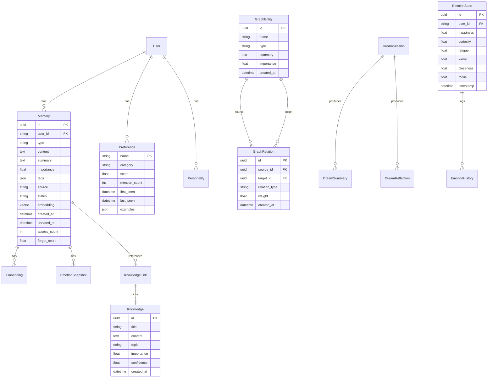

# HCC ER 图 — 数据库实体关系

## 表清单

| 表名 | 说明 | 引擎 |
|------|------|:----:|
| memories | 长期记忆存储 | PostgreSQL + pgvector |
| graph_entities | 知识图谱节点 | PostgreSQL |
| graph_relations | 知识图谱边 | PostgreSQL |
| emotion_states | 情绪状态快照 | PostgreSQL |
| emotion_history | 情绪变化历史 | PostgreSQL |
| preferences | 用户偏好 | 内存（Redis 可选） |
| dream_sessions | 梦境会话记录 | PostgreSQL |
| knowledge | 知识条目 | PostgreSQL |
