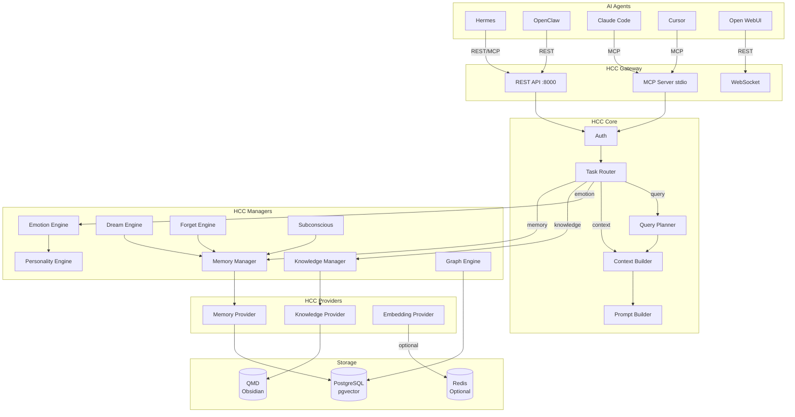

# HCC MCP 通信协议图

## 统一 API 接口

| 方法 | 端点 | Agent 调用 |
|:----|:-----|:-----------|
| REST | `POST /api/v1/context` | 单入口获取上下文 |
| REST | `POST /api/v1/memory/store` | 存储记忆 |
| REST | `POST /api/v1/memory/search` | 搜索记忆 |
| REST | `POST /api/v1/graph/query` | 查询知识图谱 |
| REST | `POST /api/v1/emotion/state` | 获取情绪状态 |
| MCP | `store_memory` | 通过 MCP 协议存储 |
| MCP | `search_memories` | 通过 MCP 协议搜索 |
| MCP | `semantic_search` | 语义搜索 |
| MCP | `get_recent_memories` | 最近记忆 |
| MCP | `delete_memory` | 删除记忆 |
