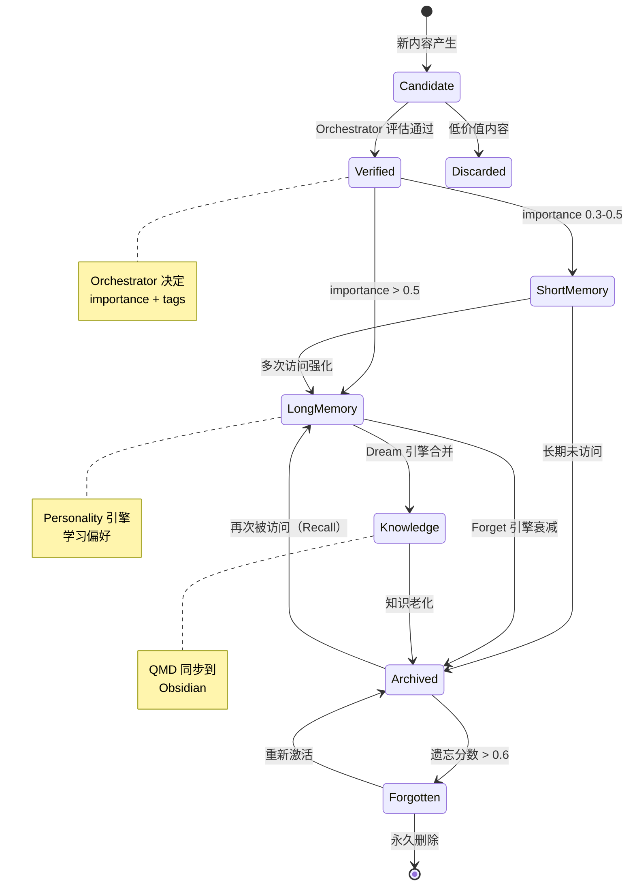

# HCC 记忆生命周期状态机

## 状态说明

| 状态 | 说明 | 触发条件 |
|:-----|------|:---------|
| Candidate | 候选记忆，等待评估 | 新对话/文件产生 |
| Verified | 已确认有价值 | Orchestrator importance ≥ 0.3 |
| Discarded | 丢弃 | 低价值内容 |
| ShortMemory | 短期记忆 | importance 0.3-0.5 |
| LongMemory | 长期记忆 | importance ≥ 0.5 |
| Knowledge | 知识化 | Dream 引擎聚类合并 |
| Archived | 归档 | Forget 分数 > 0.6 |
| Forgotten | 遗忘 | Forget 分数 > 0.8 + 90天无访问 |
| | 永久删除 | Forget 分数 > 0.95 |
