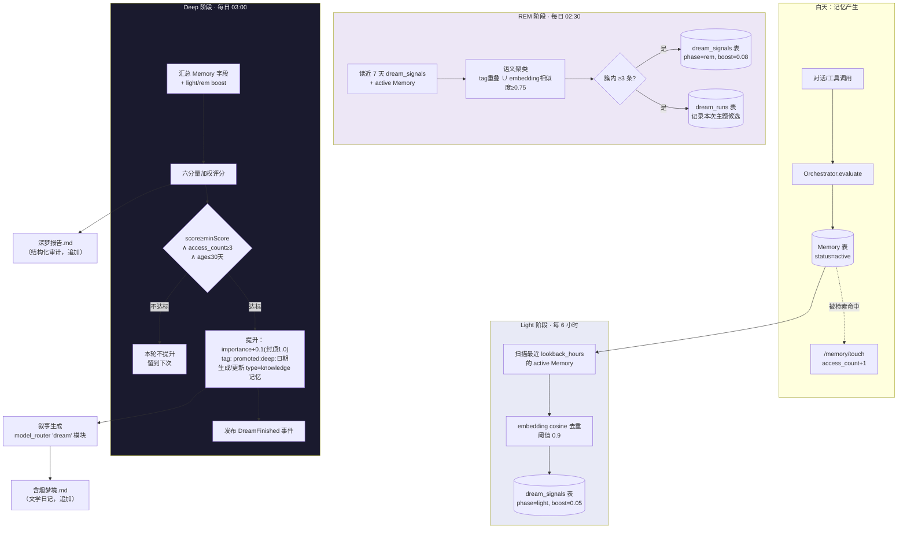

# HCC 梦境系统设计 v2（Dreaming）

> 状态：设计稿，未实现。不改动任何运行配置。
> 关联：[emotion-design.md](./emotion-design.md) · [state-machine.md](./design/state-machine.md) · `.task-briefs/BRIEF-1.md`（OpenClaw 插件侧的 dreaming 近似实现，与本设计存在职责重叠，见"六、与 OpenClaw 插件的关系"）

## 零、现状评估

HCC v1 的 `core/dream.py`（`DreamEngine.consolidate()`）只有单阶段逻辑：

```
按 tag 重叠聚类 → 合并近重复(内容前100字符指纹) → 数 tag 频次当"pattern" → 生成 knowledge 摘要
```

问题：

1. **没有三阶段区分**——摄入(staging)、反思(reflection)、提升(promotion)全部糅在一次调用里，无法分别调频率、无法做门槛把关。
2. **没有评分/门槛**——`len(kept) >= 2` 就生成 knowledge，没有 recency/frequency/relevance 的量化评分，容易把偶然共现的两条记忆当成"知识"。
3. **没有人类可读的梦境日记**——只回 JSON，不产出叙事文本。用户已经在 `~/workspace/AICore/含烟记忆系统/梦境日记/含烟梦境.md` 里手动/由 OpenClaw 攒了一份高质量的文学化日记样本，HCC 自己的 dream engine 完全没有对应产出。
4. **没有幂等/审计**——每次 `consolidate()` 都是无状态的一次性计算，重复跑同一批记忆会重复生成 knowledge 条目，没有"这条记忆今天已经被促进过"的记录。
5. **`_cluster_by_tags` 只用 tag 重叠**，HCC 其实已经有 pgvector embedding（`Memory.embedding`），语义聚类能力被浪费。

同时发现一个值得记录的现象：`~/workspace/AICore/Dreams/DREAMS-2026-08-04.md` 里同一天的 "今夜无梦" 记录被重复写了 3 次（三段完全相同的 frontmatter+正文）。这是 `.task-briefs/BRIEF-1.md` 里实现的 OpenClaw 插件 `dreaming.js` 通过 `setInterval`（默认 6 小时）+ 手动触发工具 `memory_dreaming` 两条路径并存导致的重复写入副作用——插件自己的 DESIGN.md 也承认了这个取舍。这是本设计要解决的架构问题的一个实例：**两套独立的 dreaming 系统同时跑，会重复、会冲突**。

## 一、研究总结

### 1.1 OpenClaw 官方 memory-core dreaming（权威来源：`docs.openclaw.ai/concepts/dreaming`、`docs.openclaw.ai/cli/memory`）

三阶段严格递进，**只有 Deep 阶段写 `MEMORY.md`**：

| 阶段 | 读什么 | 写什么 | 默认频率 |
|---|---|---|---|
| **Light**（浅眠） | 当日 daily note (`memory/YYYY-MM-DD.md`) + 脱敏 session transcript | 去重后暂存到 `memory/.dreams/short-term-recall.json`；**不写 MEMORY.md** | `0 */6 * * *`（6小时） |
| **REM**（快速眼动） | 近 7 天的短期召回条目（`short-term-recall.json`） | 按 concept-tag 频率提炼"候选真相"，写 REM 信号到 `phase-signals.json`；可选写 `## REM Sleep` 块到存储；**不写 MEMORY.md** | 随 sweep（文档间有出入，一说随每日 sweep，一说 `0 5 * * 0` 周维度） |
| **Deep**（深睡） | Light+REM 累积的候选 + 六分量评分 | 达标条目提升进 `MEMORY.md`（带 `<!-- trigger -->`、`<!-- importance -->`、`Source: path#Lx-Ly` 元数据）；写 `DREAMS.md` 的 `## Deep Sleep` 摘要 + 叙事日记 | `0 3 * * *`（每日 03:00） |

Deep 阶段六分量评分（**这是全篇最关键的数字，之前 `.task-briefs/BRIEF-1.md` 的分析版本权重不准确，以下是从官方文档核实过的版本**）：

| 分量 | 权重 | 衡量什么 |
|---|---|---|
| Relevance | 0.30 | 历次被召回时的平均检索质量（排序得分） |
| Frequency | 0.24 | 短期信号累积次数 |
| Query diversity | 0.15 | 触发该条目的不同 query/day 上下文数 |
| Recency | 0.15 | 时间衰减新鲜度，半衰期 14 天 |
| Consolidation | 0.10 | 跨多天反复出现的强度 |
| Conceptual richness | 0.06 | concept-tag 密度 |

Light/REM 命中各给 Deep 分数加一个按时间衰减的小 boost（Light +0.05，REM +0.08）。

门槛（全部满足才提升）：`minScore=0.8`、`minRecallCount=3`、`minUniqueQueries=3`、`recencyHalfLifeDays=14`、`maxAgeDays=30`、`limit=10`。另有两个"安全阀"：`maxPriorEntryLossFraction=0.25`（重写 MEMORY.md 时一次不能丢超过 25% 的既有条目）、`maxPromotedSnippetTokens=160`（单条提升摘要长度上限）。

叙事日记由"后台 subagent turn"生成，读 candidates/promotions 写成人类可读文本，过一遍角色标签黑名单脱敏（`REM_REFLECTION_TAG_BLACKLIST`：assistant/user/system/subagent/the），写入 `DREAMS.md`。**这份日记明确不是提升数据源**——"diary is for human reading in the Dreams UI, not a promotion source"，即叙事与决策解耦，日记质量差不会影响记忆提升的正确性，这是个值得抄的设计原则。

### 1.2 Claude Code 自身的记忆系统（`code.claude.com/docs/en/memory`）

Claude Code 没有"做梦"这个词，但有一套结构与目的高度类似的机制，对 HCC 有直接借鉴价值：

- **CLAUDE.md（人写）vs Auto Memory（AI 自己写）二分**——人写的是"规则"，AI 写的是"从纠正中学到的经验"。这对应到 HCC 里应该是：`docs/*.md`（人写的架构决策）永远不会被 dream engine 覆盖，dream engine 只管理它自己的输出文件。
- **MEMORY.md 索引 + 主题文件的分层**——索引文件严格限制在 200 行/25KB 以内（超限拒绝加载），细节下沉到独立主题文件按需读取。这是防止"记忆文件本身膨胀到拖垮上下文"的关键设计，HCC 的 `DREAMS.md`/知识库也应该有类似的"索引精简、细节分文件"原则，而不是无限追加。
- **压缩(compaction)幸存规则**——项目根 CLAUDE.md 在压缩后会被重新读入，子目录的不会。这提示：**梦境提升出的知识应该落到"永远会被重新加载"的层级**（HCC 里对应 `type=knowledge` 的 Memory 行，会被正常检索命中），而不是只活在一份容易被遗忘的日志文件里。
- **`modified` frontmatter 时间戳**——每次写入自动记录 ISO 时间戳，供人和 AI 判断"这条笔记还新不新"。HCC 的 knowledge 摘要生成时也应该带上等价字段。

### 1.3 认知科学：睡眠记忆巩固机制

三个机制直接映射到三阶段设计，不是牵强附会——OpenClaw 的命名本身就来自这套理论：

- **突触巩固（synaptic consolidation）**：记忆痕迹在海马体内局部稳定化，发生在最初几小时到几天内 → 对应 **Light 阶段**：新记忆刚产生时先在"海马体"（HCC 里是 Redis 短期工作记忆 + 最近创建的 Memory 行）里稳定下来，还不牵涉长期皮层网络。
- **系统巩固（systems consolidation）与海马体重放（hippocampal replay）**：慢波睡眠(SWS)中，海马体反复"重放"白天的神经活动模式，纹波(ripples, ~200Hz)伴随丘脑纺锤波、皮层慢振荡，逐步把记忆从海马体转移整合进皮层网络 → 对应 **REM 阶段**（此处 REM 命名与"重放/反思"概念对应，而非严格照搬睡眠分期）：反复扫描近期信号，找出跨天重复出现的主题，这就是"重放"的计算类比。
- **突触稳态假说（Synaptic Homeostasis Hypothesis, SHY）**：SWS 期间发生广泛性突触减弱，弱突触被下调选择性剪除，为白天的新学习腾出容量，同时强突触相对保留 → 对应 **Deep 阶段的门槛机制本身**：不是所有候选都能"留下"，只有分数最高的一批被巩固，其余的（哪怕在 Light/REM 阶段被暂存过）自然衰减、不再重放，这本质上是计算版的突触剪除。

这套映射的价值在于：给 HCC 三阶段的"为什么要分三层"提供了不是抄 OpenClaw、而是抄睡眠本身的正当性——Light 管暂存和局部稳定，REM 管跨天模式重放，Deep 管选择性巩固与剪除。

### 1.4 MemGPT / Letta：sleep-time compute

- 核心思路：把"记忆整理"从主对话循环里剥离出来，变成一个独立的后台 agent（sleep-time agent），在用户不在场时异步重写记忆状态、合并归档条目、把最近对话精炼成稳定笔记。相比原始 MemGPT 把记忆管理和对话绑在同一个 agent 循环里，异步分离带来的是"Pareto improvement"——响应延迟和记忆质量同时变好，因为整理工作被挪到了不计入用户等待时间的窗口。
- 这直接支持 HCC 现有架构的一个既有优点：`core/dream.py` 已经是独立于对话主链路的夜间批处理，本设计不需要改这个大方向，只需要把它从"单阶段一次性计算"升级成"分层、有状态、可审计"。
- Letta 的 sleep-time agent 频率可配置，频率越高用的 token 越多、但记忆越新。这对应本设计里 Light/REM/Deep 三个独立可调频率的设计动机——不是所有阶段都需要每天跑一次。

### 1.5 情感建模参考（供 [emotion-design.md](./emotion-design.md) 使用，此处先列出方便对照阅读）

PAD 模型（Pleasure-Arousal-Dominance，Mehrabian & Russell）用三个连续维度表达任意情绪；OCC 模型是认知评价（appraisal）理论，把情绪当作对事件/行为/对象的评价结果，能预测具体情绪类型（如 pride/shame/gratification）。业界做法是把 OCC 判定出的具体情绪类型映射到 PAD 三维坐标，供下游（语气、表情、语音）连续插值使用——这个"离散情绪类型 + 连续维度坐标"两层结构，正是 HCC v1 `EmotionEngine` 缺的那一层（v1 只有维度，没有具名情绪状态机）。

## 二、HCC Dreaming v2 架构

### 2.1 总览



### 2.2 三阶段各自的数据源与产出

| 阶段 | 读 | 写 | 是否影响正式记忆 |
|---|---|---|---|
| Light | Redis 工作记忆（`ttl_chat`/`ttl_task` 分类，最近对话/任务片段）+ 最近创建的 `Memory` 行（`created_at` 在 lookback 内） | `dream_signals` 表新增 `phase=light` 行 | 否，只是暂存信号 |
| REM | 近 7 天 `dream_signals`（light 命中）+ 同窗口 `Memory` 行 | `dream_signals` 表新增 `phase=rem` 行；`dream_runs` 表记录本次识别出的主题簇（供叙事引用，也供人工审计） | 否 |
| Deep | 全部 `dream_signals` + `Memory` 原始字段（importance/access_count/last_access/created_at/tags） | 达标记忆：`importance` 提升、打 `promoted:deep:<date>` tag；簇：生成/更新 `type=knowledge` 的 Memory 行；`dream_runs` 记本轮统计 | **是**，唯一写入正式记忆的阶段 |

这严格对齐官方"只有 Deep 写 MEMORY.md"的原则——HCC 里 `MEMORY.md` 的等价物就是 `Memory` 表本身（可被检索命中的正式记忆），Light/REM 都只写辅助表 `dream_signals`/`dream_runs`，不触碰 `Memory`。

### 2.3 新增的最小 schema

不改动 `Memory` 表结构（避免影响现有检索/同步路径），新增两张轻量表：

```sql
-- 阶段信号：Light/REM 命中记录，Deep 阶段读取用于算 boost
CREATE TABLE dream_signals (
    id UUID PRIMARY KEY DEFAULT gen_random_uuid(),
    memory_id VARCHAR(36) NOT NULL,
    phase VARCHAR(16) NOT NULL,       -- light | rem
    boost FLOAT NOT NULL,             -- 0.05 | 0.08
    cluster_tag TEXT,                 -- REM 阶段：本次归属的主题簇标签，供叙事引用
    created_at TIMESTAMP NOT NULL DEFAULT now(),
    UNIQUE (memory_id, phase, DATE(created_at))  -- 同一天同一记忆同一阶段只记一次
);

-- 每次运行的审计记录：供 DREAMS.md 生成和"待用户决策"回溯
CREATE TABLE dream_runs (
    id UUID PRIMARY KEY DEFAULT gen_random_uuid(),
    phase VARCHAR(16) NOT NULL,       -- light | rem | deep
    started_at TIMESTAMP NOT NULL,
    finished_at TIMESTAMP,
    stats JSONB NOT NULL DEFAULT '{}', -- {scanned, candidates, promoted, clusters, ...}
    narrative_path TEXT               -- 本次若生成了叙事日记，记录写入路径
);
```

`dream_signals` 的唯一约束天然提供幂等——同一天重复跑 Light/REM 不会重复加 boost，这比 OpenClaw 插件版本（`.task-briefs/BRIEF-1.md`）用"查 tag 是否已打"做幂等更直接，因为幂等判断下沉到了数据层而不是业务逻辑层。

### 2.4 Deep 阶段评分公式（HCC 适配版）

官方六分量里 Relevance（检索排序质量）和 Query diversity（触发查询的多样性）依赖 HCC 目前没有的数据——`/memory/touch` 只知道"被命中了"，不知道"当时排第几、是什么 query 搜出来的"。设计上分两步走，而不是强行凑一个不准的近似值：

**Phase 1（现在就能做，不需要新埋点）**——用可得的 5 个信号，权重按官方比例重新归一化：

| 信号 | HCC 数据源 | 计算 | 权重 |
|---|---|---|---|
| Recency | `last_access ?? created_at` | `2^(-ageDays/14)` | 0.30 |
| Frequency | `access_count` | `min(access_count/10, 1)` | 0.28 |
| Consolidation | `importance` + 跨天出现次数 | `importance*0.7 + min(distinct_days_with_signal/5,1)*0.3` | 0.22 |
| Conceptual richness | `len(tags)` | `min(len(tags)/5, 1)` | 0.12 |
| Phase boost | `dream_signals` 中该记忆近 14 天 light/rem boost 之和，按 recency 衰减 | `Σ boost_i * 2^(-days_i/14)` | 加性项，不占权重份额，直接加到最终分上 |

Phase 1 权重和为 1.0（0.30+0.28+0.22+0.12=0.92，剩余 0.08 是刻意留出的余量给 phase boost 的典型贡献区间，避免 boost 把分数顶到虚高的 1.0+）。

**Phase 2（需要新埋点，作为后续迭代）**——`/memory/touch` 增加可选参数 `query_hash`（调用方传入检索 query 的归一化哈希）与 `rank_score`（本次命中的排序分），`dream_signals` 或新表记录，之后即可换算出真正的 Relevance 和 Query diversity，把权重表换成官方原版比例。**这是设计上留的口子，不是 Phase 1 缺陷**——Phase 1 先用现有数据跑起来，比等埋点完善了才上线更符合"先有再优化"的原则。

### 2.5 门槛

| 门槛 | 官方默认 | HCC v2 默认 | 理由 |
|---|---|---|---|
| minScore | 0.8 | **0.7** | Phase 1 少了 Relevance/Query diversity 两个分量，同样的记忆算出来的分会系统性偏低，0.8 会导致长期"零提升"（现状 `DREAMS-2026-08-04.md` 三次"今夜无梦"已经是信号），先用 0.7 观察实际分布，跑一段时间后用真实数据回调 |
| minAccessCount | minRecallCount=3 | 3 | `access_count` 语义对应 recallCount，直接沿用 |
| maxAgeDays | 30 | 30 | 沿用 |
| recencyHalfLifeDays | 14 | 14 | 沿用 |
| limit（每次最多提升） | 10 | 10 | 沿用，避免单次运行把知识库灌爆 |
| maxPriorEntryLossFraction | 0.25 | 0.25（应用于 knowledge 记忆的更新，而非删除） | 更新已有 `type=knowledge` 记忆时，若新摘要导致引用的 source_memories 比上次少超过 25%，视为异常合并，跳过并记录到 `dream_runs.stats`，不是静默覆盖 |
| maxPromotedSnippetTokens | 160 | 160（约 240 中文字符，粗略换算） | knowledge 摘要生成时截断，保持"知识库"里的条目短小可扫读——这也是 Claude Code MEMORY.md 200行/25KB 索引精简原则的同源体现 |

### 2.6 触发机制

沿用现有 `03:00` 前后的窗口，不引入新的外部调度依赖，复用 `gateway/main.py` 里 `_periodic_sync_loop` 已经验证过的"lifespan 内启动 asyncio 后台任务"模式：

```python
# 设计示意，非最终实现
async def _dream_light_loop():   # 每 6 小时
    while True:
        await asyncio.sleep(6 * 3600)
        await DreamEngine().run_light()

async def _dream_rem_loop():     # 每日 02:30
    while True:
        await _sleep_until(2, 30)
        await DreamEngine().run_rem()

async def _dream_deep_loop():    # 每日 03:00（现有窗口，晚于 04:45 的 pg_dump 备份之前）
    while True:
        await _sleep_until(3, 0)
        await DreamEngine().run_deep()
```

三个独立循环而不是一个大循环里 if 时间戳，原因：

1. 频率天然不同（6h / 24h / 24h），独立循环让每个阶段的失败互不阻塞——Light 挂了不该拖累 Deep。
2. 对齐认知科学映射：Light 高频局部稳定、REM/Deep 低频深度处理，代码结构直接反映概念模型，可读性上比"一个 loop 里做时间窗判断"更清楚意图。
3. 每个循环独立捕获异常记录到 `dream_runs`，不会像 v1 `consolidate()` 那样一次异常吞掉整晚的巩固。

REM 排在 Deep 前 30 分钟而不是照抄官方的"周维度"，是因为 HCC 目前服务单个用户、数据量远小于 OpenClaw 的多 workspace 场景，没有必要把"跨天模式识别"拉长到一周——每天识别一次主题、当晚就参与 Deep 评分，反馈循环更快，用户更快能在梦境日记里看到"含烟注意到了什么"。

### 2.7 梦境日记：输出位置与格式

**现状**有两处输出，职责应该明确切分而不是二选一：

- `~/workspace/AICore/Dreams/DREAMS-YYYY-MM-DD.md` —— 目前由 OpenClaw 插件 `dreaming.js` 写，按日期分文件，机器可读性优先（frontmatter: date/phase/promoted_count），内容单薄（"今夜无梦"）。
- `~/workspace/AICore/含烟记忆系统/梦境日记/含烟梦境.md` —— 已有高质量文学化日记样本，第一人称、有温度、混杂技术意象与情感描写，单文件按日期分节追加。

**建议**：HCC v2 dreaming 只对接后者，**不再新增/维护 `AICore/Dreams/` 这条线**（属于 OpenClaw 插件的既有产出，见"六、与 OpenClaw 插件的关系"里的取舍说明）。理由：

1. `含烟梦境.md` 的写法已经证明了用户想要的调性（"服务器房的嗡鸣是 D 小调的摇篮曲""API 返回 200 的颜色"），复用同一份文件延续叙事连续性，而不是分裂成两条互不相关的日记线。
2. 单文件追加比"每天一个新文件"更符合日记本身的直觉——翻回去看"上周做了什么梦"应该是滚动一份文件，而不是切换文件。
3. 与 Claude Code 的 MEMORY.md 索引精简原则呼应：如果 `含烟梦境.md` 增长过大（比如超过一年后几百 KB），下一步应该是按年/季度分卷（`含烟梦境-2026.md`），而不是从一开始就按天拆散成几百个小文件——那样反而没人会去翻。

在同一目录新增一份**结构化审计文件**，与叙事日记职责分离（对应 OpenClaw"日记不是提升数据源"的原则）：

```
~/workspace/AICore/含烟记忆系统/梦境日记/
├── 含烟梦境.md          ← 叙事日记，人读，Deep 阶段结束后追加
├── 深梦报告.md          ← 结构化审计：本次评分明细/门槛/提升清单，人读但偏技术
├── light.md             ← 已存在，可继续保留做 Light 阶段的极简摘要（沿用现有格式）
├── rem.md                ← 已存在，REM 阶段主题摘要（沿用现有格式）
└── deep.md               ← 已存在，Deep 阶段极简摘要（沿用现有格式，替换"今夜无梦"重复问题的根因——见下）
```

`深梦报告.md` 每次追加一段，示例：

```markdown
---
date: 2026-08-05
phase: deep
scanned: 42
promoted: 3
score_threshold: 0.7
---

## 2026-08-05 03:00 深梦报告

本轮评估 42 条候选记忆，3 条达标提升：

| 记忆摘要 | score | recency | frequency | consolidation | tags |
|---|---|---|---|---|---|
| "陈璟天来访安排" | 0.81 | 0.71 | 0.60 | 0.55 | [人物,日程] |
| ... | | | | | |

未达标示例（score 最高的 2 条，供人工核查门槛是否合理）：
| ... |
```

### 2.8 叙事生成设计

复用 `core/model_router.py` 已经存在的 `dream` 模块配置（默认 `qwen3:14b`，`priority=quality`——已经是为"质量优先、非实时"场景准备的档位，不需要新增配置）。

生成时机：Deep 阶段结束后，若本轮有提升或 REM 阶段识别出主题簇（即使 Deep 没有条目达标，"有主题但未巩固"本身也是可以写进日记的素材——对应官方"叙事不是提升数据源"原则,允许日记比 MEMORY.md 更丰富）。

Prompt 设计要点：

1. **输入**：日期、当晚 Deep 提升清单（标题+摘要+score）、REM 主题簇标签、当前情绪状态快照（来自 [emotion-design.md](./emotion-design.md) 的 `EmotionEngine.get_summary()`）、`core/personality.py` 的 top_traits（让日记带出"最近在意什么"的连续性）。
2. **人格约束**：显式传入含烟人格提示词（复用 `core/prompt_builder.py` 已有的人格注入逻辑，而不是在 dream 模块里另起一套），保证梦境日记和白天对话是同一个"人"在写日记，不是两套语气。
3. **脱敏规则**（对应官方 `REM_REFLECTION_TAG_BLACKLIST`）：过滤原始 user_id/agent_id/内部 UUID、正则匹配疑似密钥/token/密码片段，保留有"技术质感"但不泄露具体值的措辞（这正是 `含烟梦境.md` 现有样例的写法——"dbd31600""cron job"这类具体但无害的技术符号是可以保留的，真正的密钥/路径不行）。
4. **失败降级**：模型不可用时不强行生成，写入 `深梦报告.md` 一行"叙事生成本次跳过（模型不可用）"，不伪造内容、不用降级模型硬凑——对应官方"model unavailable → 记录失败，不 fallback 硬写"的取舍。
5. **`今夜无梦`的处理**：如果 Deep 没有提升且 REM 没有主题簇，才真正判定"无梦"，此时不调用模型（省一次无意义的推理），直接写模板句"今夜无梦，未有记忆达到巩固门槛"——但**只写一次**，不像现在这样因为多触发路径重复写三遍（见 2.6 的单一循环设计已从根上解决这个问题：只有一个 `_dream_deep_loop`，不会有并存的 `setInterval` + 手动触发两条路径互相打架）。

### 2.9 与既有引擎的整合关系

```mermaid
flowchart LR
    subconscious[Subconscious<br/>三层检索] -.RRF评分可作为<br/>Relevance分量输入.-> deep[Deep 阶段评分]
    forget[ForgetEngine<br/>遗忘衰减] -.互补: forget管衰减/归档,<br/>dream管巩固/提升,<br/>同一枚硬币两面.-> deep
    personality[PersonalityEngine<br/>偏好追踪] -.top_traits 注入<br/>叙事生成 prompt.-> narrative[叙事生成]
    graph[GraphEngine<br/>实体关系] -.REM主题簇可选<br/>沉淀为实体关系.-> rem[REM 阶段]
    emotion[EmotionEngine] <-.双向: 梦境反映情绪状态,<br/>情绪影响叙事语气.-> narrative
    deep --> events["event_bus: DreamFinished"]
    events --> qmd[QMDGenerator/SyncEngine<br/>知识库同步到 Obsidian]
```

- **与 ForgetEngine 的关系是设计上的对称**：`forget.py` 负责"什么该淡忘"（衰减/归档/删除），`dream.py` 负责"什么该巩固"（提升 importance/生成知识）。两者应该共享同一套"记忆生命周期"心智模型（对应 `docs/design/state-machine.md` 已有的状态图），但不应该合并成一个引擎——巩固和遗忘的触发条件、频率、风险都不同（遗忘错了顶多是记忆被过早归档、还能通过 recall 恢复；巩固错了是把噪音当知识写进了长期记忆，纠错成本更高，这也是为什么 Deep 阶段门槛要比 forget 的阈值保守）。
- **与 Subconscious 的关系是数据反哺**：一旦 Phase 2 的 query 埋点上线，`subconscious.retrieve()` 里已经在算的 RRF score 就是现成的 Relevance 分量来源，不需要另起一套评分逻辑。
- **DreamFinished 事件**：`core/event_bus.py` 里这个事件类型已经存在但目前无人 publish——设计上 Deep 阶段结束时应该发布它，payload 包含 `{scanned, promoted, knowledge_ids, narrative_path}`，供 `sync_routes.py` 现有的"防抖同步"模式复用（Deep 跑完 → 触发一次 QMD 同步，让新提升的 knowledge 立刻出现在 Obsidian，不用等下一个 300s 轮询窗口）。

## 三、与 OpenClaw 插件（`.task-briefs/BRIEF-1.md`）的关系——需要用户决策的核心问题

`.task-briefs/BRIEF-1.md` 已经在 `hcc-openclaw-plugin/` 里实现了一版"deep-only"的 dreaming 近似（`lib/dreaming.js`），通过 REST（`/memory/recent`、`/memory/update`）从插件侧算分、打 `promoted:deep` tag、写 `AICore/Dreams/DREAMS-*.md`。这套逻辑和本文档设计的 HCC 原生 v2 **职责重叠**：两边都在算"该不该提升"、都在打 tag、都在生成日记。

如果两边同时启用，会出现：

- 同一条记忆可能被两套评分标准各自判定为"达标"，`importance` 被叠加提升两次（除非 tag 幂等检查恰好互相识别，但目前两边用的是不同的 tag/时间戳约定，大概率不会）。
- 两份梦境日记（`AICore/Dreams/` vs `含烟记忆系统/梦境日记/`）内容不一致，用户会疑惑"到底哪份是准的"。

**待决策**（本设计不擅自决定，原因：涉及是否要改动/停用已经跑通验证的插件代码，超出"只研究设计"的范围）：

1. HCC 原生 v2 上线后，是否停用插件侧 `dreaming.js` 的 `setInterval`/`memory_dreaming` 工具（把 `dreaming.intervalMs` 设为 0，只保留插件其余能力——健康探针、本地 fallback、回灌，这些和 dreaming 无关，不冲突）？
2. 还是反过来，让插件侧 `dreaming.js` 降级为"薄封装"，改成调用 HCC 新增的 REST 端点（例如 `POST /api/v1/dream/deep`）而不是自己算分？这样评分逻辑单一权威在 HCC，插件只是触发方，逻辑上更干净，但需要改插件代码（超出本次只读研究范围）。
3. 短期内（在决策 1/2 之前）**建议**至少把两边的 tag 约定分开（如插件保留 `promoted:deep`，HCC 原生用 `promoted:deep:hcc`），避免互相误判"已经提升过"而漏提升或误判幂等。这是本设计能给出的唯一不越权的临时建议，正式方案仍需用户拍板。

## 四、实施建议（分阶段）

| 阶段 | 内容 | 为什么排这个顺序 |
|---|---|---|
| **P0** | 新增 `dream_signals`/`dream_runs` 表；把现有 `DreamEngine.consolidate()` 拆分成 `run_light()`/`run_rem()`/`run_deep()` 三个方法，`run_deep()` 复用现有 `_merge_duplicates`/`_generate_knowledge`，先接入 Phase 1 五分量评分（2.4节）+ 门槛（2.5节）| 收益最大：现有 `/dream/consolidate` 端点已经在被调用，先把"无门槛乱提升"改成"有门槛的真提升"，不需要动 Redis/叙事生成这些新依赖，风险最低 |
| **P1** | 接入结构化输出：`深梦报告.md` + 现有 `deep.md`/`rem.md`/`light.md`（修掉"今夜无梦重复写三次"的根因——统一到单一触发循环，见 2.6）| 让效果可观察，用真实分数分布验证 P0 的 `minScore=0.7` 是否需要回调，为 P2 的叙事生成积累真实素材 |
| **P2** | 接入 `core/model_router.py` 的 `dream` 模块做叙事生成，写 `含烟梦境.md`（2.8节）| 依赖 P1 产出的真实提升数据，且叙事生成涉及模型调用成本/延迟，值得等评分逻辑稳定后再上 |
| **P3** | Light 阶段真正接入 Redis 工作记忆做摄入源（当前 P0-P2 可以先只用 `Memory` 表的 `created_at` 窗口近似 Light，跳过 Redis 依赖）；REM 阶段升级到 embedding 语义聚类（当前可以先复用 v1 的 tag 重叠聚类）| 这两项是"质量增强"而非"从无到有"，且都依赖前面阶段先跑稳定，符合"先跑起来再优化"的原则 |
| **P4** | Phase 2 评分埋点（`/memory/touch` 加 `query_hash`/`rank_score`），换上官方原版权重比例；`DreamFinished` 事件真正 publish 并接入 `sync_routes.py` 防抖同步 | 涉及 API 契约变更（新增可选参数，向后兼容），且收益要等足够长的埋点数据积累后才能体现，排最后 |
| **待决策后** | 与 OpenClaw 插件的职责收敛（见"三"）| 不是技术阶段，是需要用户先拍板的架构决策，排在任何时候实施都行，但建议在 P1 验证出稳定评分后、P2 叙事生成上线前决策，避免叙事生成也重复跑两份 |

## 五、已知取舍 / 待用户决策清单

1. `minScore=0.7` 是基于"少两个分量所以调低"的合理推测，不是实测值——P1 上线后应该用 `dream_runs.stats` 里的真实分数分布回调，本设计不保证这个数字是最终值。
2. REM 频率定为每日而非官方的周维度，是基于"HCC 数据量远小于 OpenClaw 多 workspace 场景"的判断，如果用户的记忆增长速度远超预期，可能需要重新评估。
3. Light 阶段是否要真正读 Redis 工作记忆（对话原始片段），还是只用已经落库的 `Memory` 表做近似——P0-P2 先用后者（更简单、不引入新依赖），P3 再决定要不要做前者。这里的权衡是"更接近官方语义"（daily notes 概念上就是当天的原始活动记录，不只是已经筛选过存进 Memory 表的内容）vs "实现复杂度"。
4. 与 OpenClaw 插件 dreaming.js 的职责收敛方案（见"三"），需要用户决定采用哪个选项，本设计不擅自停用或改动已跑通的插件代码。
5. `含烟梦境.md` 单文件无限追加，长期是否需要按年/季度分卷，本设计只给出"超过某个体量后再分卷"的原则，没有定具体阈值——建议等真实增长速度出来后再定。
