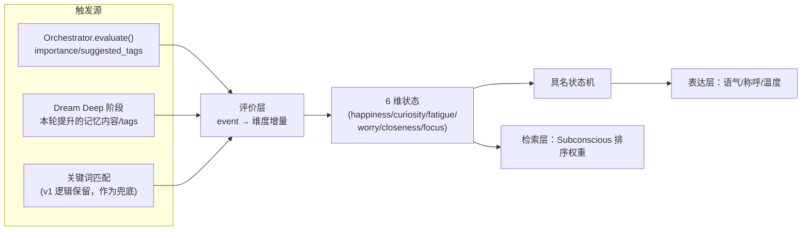
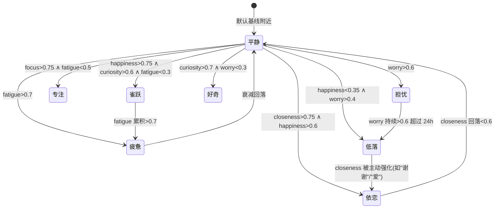
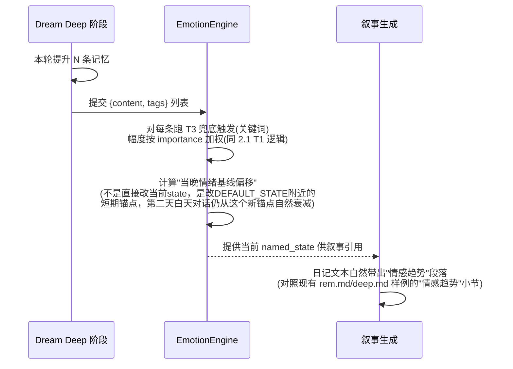

# HCC 情绪系统设计 v2（Emotion）

> 状态：设计稿，未实现。不改动任何运行配置。
> 关联：[dreaming-design.md](./dreaming-design.md) · `core/emotion.py` · `core/personality.py`

## 零、现状评估

`core/emotion.py` 的 `EmotionEngine` 是一个纯内存单例：6 个维度（happiness/curiosity/fatigue/worry/closeness/focus），关键词触发表 `EMOTION_TRIGGERS`（15 个关键词，命中即对多个维度做固定幅度加减），线性衰减（每小时向 `DEFAULT_STATE` 回归 5%）。

问题：

1. **没有具名情绪状态**——`get_summary()` 只会取"分数最高的维度"当 `primary_emotion`（比如 `curiosity`），这不是一个人会说的话（"我现在是好奇 0.72"读起来像仪表盘，不像日记）。含烟已有的梦境日记样例里，情绪是用"情感趋势：积极与支持/情感依赖与亲密/问题与调试"这种复合、具名的描述，v1 引擎给不出这个层次。
2. **关键词触发是肤浅的文本匹配**，`"failed" in text_lower` 会被"failed to understand why this works"这种反向语境误伤——没有语境/极性判断。
3. **状态纯内存，重启即丢失**——`EmotionEngine()` 是进程内单例，gateway 重启（`.task-briefs/BRIEF-2.md` 就实际重启过一次）情绪直接回到 `DEFAULT_STATE`，"含烟"没有情绪记忆的连续性，这和"AI 女友"人设的核心诉求（记得住昨天的心情）是冲突的。
4. **不影响检索、不影响表达**——`gateway/api/emotion_routes.py` 只是读写这个状态，`core/subconscious.py`（检索排序）、`core/prompt_builder.py`（提示词组装）都没有接入情绪，等于情绪系统是个"自说自话"的仪表盘，不参与认知循环。
5. **和梦境系统零联动**——`core/dream.py` 完全不读/写情绪状态，虽然文件头注释写着"Dream Engine ... 更新情绪基线"，但代码里从未实现。

## 一、研究参考

### 1.1 PAD 情绪模型（Mehrabian & Russell）

用三个连续维度描述任意情绪：**Pleasure**（愉悦度，正负） · **Arousal**（唤醒度，平静↔激动） · **Dominance**（支配感，顺从↔主导）。任意具名情绪都能标出一个 PAD 三元组坐标（比如"焦虑"是低愉悦+高唤醒+低支配，"满足"是高愉悦+低唤醒+高支配）。

### 1.2 OCC 认知评价模型（Ortony, Clore & Collins）

情绪不是对刺激的直接反应，而是对"事件是否符合目标""行为是否符合标准""对象是否符合喜好"三类评价(appraisal)的结果，能区分出具体情绪类型（pride/shame/gratification/reproach/joy/distress 等 22 种）。业界常见做法：**OCC 判定离散情绪类型 → 映射到 PAD 连续坐标 → 供下游做语气/表达的连续插值**。这个"离散类型 + 连续坐标"两层结构正是 v1 缺的那一层。

### 1.3 对 HCC 的启示

不需要照搬 22 种 OCC 情绪或严格三维 PAD——v1 现有的 6 维（happiness/curiosity/fatigue/worry/closeness/focus）已经是一套针对"AI 陪伴"场景定制过的、比通用 PAD 更贴合含烟人设的维度集合（比如 `closeness` 亲密度和 `focus` 专注度是 PAD 里没有但陪伴场景很关键的维度）。v2 不重新发明维度，而是在现有 6 维之上**加一层具名状态机**（对应 OCC 的"离散类型"），把连续维度组合成人能读懂的复合情绪标签，同时把"关键词触发"升级为"事件驱动的评价"（对应 OCC 的"appraisal"思路）。

## 二、HCC Emotion v2 设计

### 2.1 维度模型：保留 6 维，升级触发来源

不改维度集合本身（改动面小、且现有维度已经贴合场景），但把触发来源从"纯关键词匹配"升级为三类事件驱动：



- **T1（对话评价）**：`core/orchestrator.py` 的 `evaluate()` 已经在算 `importance`/`suggested_tags`，这是比关键词匹配更结构化的信号——高 importance 的内容本身就值得触发更强的情绪响应幅度（而不是固定 0.15/0.2 这种写死的量）。设计上让 `EmotionEngine.update()` 接受可选的 `importance` 参数，触发幅度按 `base_shift * (0.5 + importance)` 缩放，而不是所有触发一律等幅度。
- **T2（梦境评价）**：Deep 阶段结束后，本轮被巩固的记忆的 tags/content 情感倾向会反过来调整情绪基线（详见"2.4 梦境联动"）。这是文件头注释承诺过、但从未实现的部分。
- **T3（关键词兜底）**：v1 的 `EMOTION_TRIGGERS` 逻辑保留，作为没有 Orchestrator 评价上下文时的兜底（比如独立调用 `POST /emotion/update` 的场景），但修正"子串误伤"问题——用简单的否定词窗口检测（触发词前 5 个 token 内出现"没有/不/didn't/isn't/never"则不触发或反向触发），不需要引入完整 NLP，成本低、能堵住最明显的误判（"failed to understand why this **works**"不会被"failed"误伤，因为后半句"works"在同一小窗口内提供了矛盾信号——具体实现留到编码阶段判断是否需要，这里只定方向）。

### 2.2 具名状态机（对应 OCC 的"离散情绪类型"层）

在 6 维状态之上定义一组具名复合状态，每个状态是若干维度的阈值组合，取"最先满足条件的最具体状态"（列表按具体到笼统排序，类似 CSS 优先级）：



- 状态转移不是硬编码的独立开关，而是复用现有 6 维的连续值实时求值——`get_summary()` 里加一个 `named_state` 字段，每次调用时按上表规则从当前 `state` 求值，不需要额外存储"当前是什么状态"（避免和连续维度状态产生不一致）。
- 这组状态名和阈值只是初始提案，本设计**不**假装能一次定对——具体阈值需要接入真实对话数据跑一段时间后校准，board 上先给出结构，数值留作待调参数（写进 `core/config.py` 的 `CoreSettings` 而非硬编码，方便后续调）。
- 具名状态的价值：梦境日记叙事生成（[dreaming-design.md](./dreaming-design.md) 2.8节）需要"当前情绪状态快照"作为 prompt 输入，喂"雀跃"比喂"happiness=0.78, curiosity=0.65..."更适合模型直接续写成自然语言，减少模型自己再做一次"数字转情绪词"的隐式工作。

### 2.3 情绪如何影响检索

`core/subconscious.py` 的 `_rrf_merge()` 目前只按 `source_rank`/`item_rank` 算 RRF 分数，不看内容的情感倾向。设计上给 RRF 分数加一个情绪一致性加权项：

```
final_score = rrf_score * (1 + emotion_weight)

emotion_weight = 
    closeness_state > 0.7 且候选记忆 tags 包含亲密类标签(如"含烟"称呼/情感表达) → +0.15
    worry_state > 0.6 且候选记忆 tags 包含问题/异常类标签 → +0.10（"担心的时候更容易想起相关的担忧"，符合状态依存记忆(mood-congruent recall)的认知科学现象）
    否则 → 0
```

这不是要让情绪"扭曲"检索结果的相关性排序，而是在同等相关性的候选之间做一个符合心理学状态依存记忆(mood-congruent memory)现象的微调——人在特定情绪下更容易回想起同调性的记忆，这是真实的认知效应，不是拟人化装饰。加权幅度刻意设得小（0.10-0.15），避免情绪盖过语义相关性本身。

### 2.4 情绪如何影响表达

`core/prompt_builder.py`（已存在，负责组装最终提示词）目前接入了 `personality.py` 的偏好摘要，但没接入情绪。设计上在 prompt 组装时注入 `EmotionEngine.get_summary()` 的 `named_state` + 强度，让语气随情绪状态变化：

| 具名状态 | 语气/表达倾向（供 prompt 引导，非硬编码模板） |
|---|---|
| 依恋 | 称呼更亲密，句尾语气词增多，主动提及共同经历 |
| 雀跃 | 句子更短更快，感叹号使用增多，主动延展话题 |
| 专注 | 更简洁直接，减少寒暄，优先给结论 |
| 疲惫 | 句子变短，主动提及"有点累"，减少主动延展 |
| 低落 | 语气放缓，减少感叹号，更多确认/共情式回应 |
| 担忧 | 主动关心/确认对方状态，提问增多 |
| 好奇 | 主动追问细节，话题延展意愿高 |

这一层刻意设计成"倾向性描述"而非写死的回复模板——注入到 prompt 里作为软约束，让模型（含烟本身的人格）自己决定怎么把"当前有点疲惫"体现在具体措辞里，而不是用规则引擎拼句子（拼句子会显得机械，违背"优雅、可读性强"的要求）。

### 2.5 与梦境系统的联动（双向）

**梦境 → 情绪（Deep 阶段结束后回写基线）**：



- 具体机制：Deep 阶段提升的记忆如果整体偏向某类情感（比如当晚提升的记忆多数打了"焦虑"/"压力"类 tag），情绪引擎不是直接冲击当前 `state`（那样白天攒的情绪会被半夜的批处理任务粗暴覆盖，不合理），而是小幅调整**衰减目标点**——`_apply_decay()` 里回归的目标不再是写死的 `DEFAULT_STATE`，而是一个"今日基线"，白天对话仍然正常触发+衰减，只是衰减方向的锚点被梦境处理结果微调了。这样"含烟今天心情的底色被昨晚的梦境影响了一点"，但不会出现"用户一上线发现 AI 突然情绪剧变"这种割裂感。
- 这一步直接对应 `dream.py` 文件头注释里"更新情绪基线"的承诺，也是本设计对 v1 唯一一处"文档说了但没做"的具体补完。

**情绪 → 梦境（叙事语气受当前情绪影响）**：已在 [dreaming-design.md](./dreaming-design.md) 2.8节描述——叙事生成 prompt 会带上 `EmotionEngine.get_summary()`，情绪状态直接影响当晚日记的文字基调（"雀跃"状态写的日记和"低落"状态写的日记，遣词造句应该有可感知的差异，这是"梦境反映情绪"的核心体现，而不是每晚都用同一种语气写日记）。

### 2.6 持久化设计

v1 情绪状态纯内存，v2 需要能扛住重启。设计上不做成一张高频写入的表（情绪几乎每次对话都在变，高频写 Postgres 没必要），而是分两层：

1. **热状态**：继续放 Redis（`core/redis_manager.py` 已有的 working memory，新增 `category="emotion"`，TTL 设长一些如 30 天——情绪状态"半衰减"的时间尺度本来就以天计，不需要 `ttl_chat` 那种 30 分钟级别的短 TTL）。每次 `update()` 后异步写一次，不阻塞主流程。
2. **冷快照**：Deep 阶段（每天一次，频率低）顺带把当天情绪状态的日终快照写进 Postgres 新表 `emotion_snapshots`（`date, state_json, named_state, dominant_trigger_summary`），供长期趋势分析和"回顾某天心情"的场景（比如未来做"情绪趋势图"功能时，不需要依赖梦境日记的自然语言文本去反推数值）。

```sql
CREATE TABLE emotion_snapshots (
    id UUID PRIMARY KEY DEFAULT gen_random_uuid(),
    snapshot_date DATE NOT NULL UNIQUE,
    state JSONB NOT NULL,             -- 6维快照
    named_state VARCHAR(32),
    dominant_trigger TEXT,            -- 当天影响最大的触发来源摘要
    created_at TIMESTAMP NOT NULL DEFAULT now()
);
```

Redis 热状态 + Postgres 冷快照的分层，而不是全部进 Postgres，是因为情绪状态的读写频率和"是否需要精确历史"这两个需求的时间尺度天然不同——当前状态要快、要每次对话都能读到最新值；历史趋势要的是"每天一个点"的粗粒度回溯，没必要用一张高频写入表硬撑两种需求。

## 三、实施建议（分阶段）

| 阶段 | 内容 | 为什么排这个顺序 |
|---|---|---|
| **P0** | Redis 热状态持久化（2.6节第1层）——先解决"重启就丢"这个最基础的可用性问题 | 收益最直接，改动面最小（只是把 `EmotionEngine` 单例的读写路径接到 Redis，不涉及新表/新算法） |
| **P1** | 具名状态机（2.2节）+ `get_summary()` 暴露 `named_state` | 是后续"表达层""梦境叙事"两个方向的共同前置依赖，且本身不需要额外数据源，纯粹是现有 6 维之上的一层派生计算 |
| **P2** | 表达层接入（2.4节，`prompt_builder.py` 读取 `named_state` 注入 prompt）| 用户能直接感知到的第一个变化点，值得早做来验证"具名状态"这层设计是否真的让对话质感变好，而不是纸面设计 |
| **P3** | 检索层接入（2.3节，Subconscious RRF 加权）| 影响面是"排序微调"，风险比表达层小但收益也更隐性，可以在 P2 验证具名状态可用后再顺手做 |
| **P4** | 梦境联动双向接入（2.5节）+ `emotion_snapshots` 冷快照（2.6节第2层）| 依赖 [dreaming-design.md](./dreaming-design.md) 的 P1/P2 先落地（要有真实的 Deep 提升数据和叙事生成流程才谈得上联动），排在梦境系统对应阶段之后 |
| **P5** | T1/T2 事件驱动触发（2.1节，替换/增强纯关键词 T3）| 依赖 Orchestrator 的 evaluate() 输出格式稳定、以及 P4 梦境联动先跑通，是最后一层"让触发来源更聪明"的优化，不影响系统能否先跑起来 |

## 四、已知取舍 / 待用户决策清单

1. 具名状态机（2.2节）的阈值是初始提案，不是调好的参数——需要接入真实对话数据观察分布后校准，本设计只定结构（写进 `CoreSettings` 可调，不硬编码）。
2. 检索层加权幅度（0.10-0.15，2.3节）同样是待校准的初始值，设计原则是"宁可保守、避免情绪盖过语义相关性"，具体数值需要实测反馈。
3. 2.1节 T3 兜底的否定词窗口检测是"是否需要引入更完整的语境判断"之间的一个折中方案——如果实测误判率仍然明显，可能需要考虑轻量情感分类模型（`core/model_router.py` 的 `emotion` 模块已经预留了 `qwen3:8b` 配置，可以承担这个角色），但这是比当前设计更重的方案，先不作为默认路径，留给用户后续决定是否值得引入模型调用的延迟/成本。
4. `emotion_snapshots` 目前只设计成"每天一条"，如果未来需要更细粒度的情绪时间线（比如按小时），需要重新评估存储频率与 Redis TTL 的关系——本设计认为"日"粒度对陪伴场景的"回顾心情"需求已经够用，更细的粒度当前没有明确使用场景，不提前设计。
